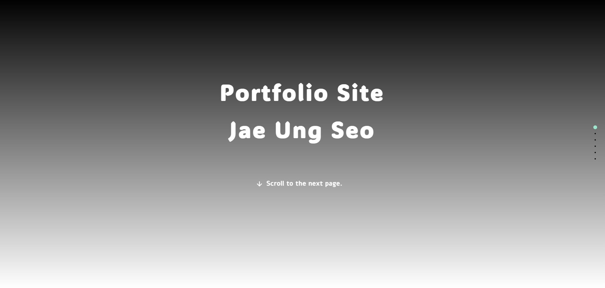
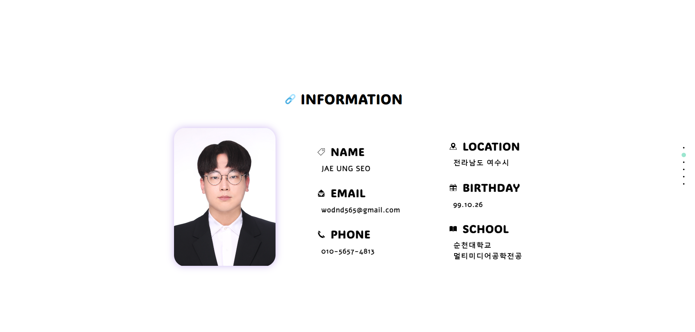
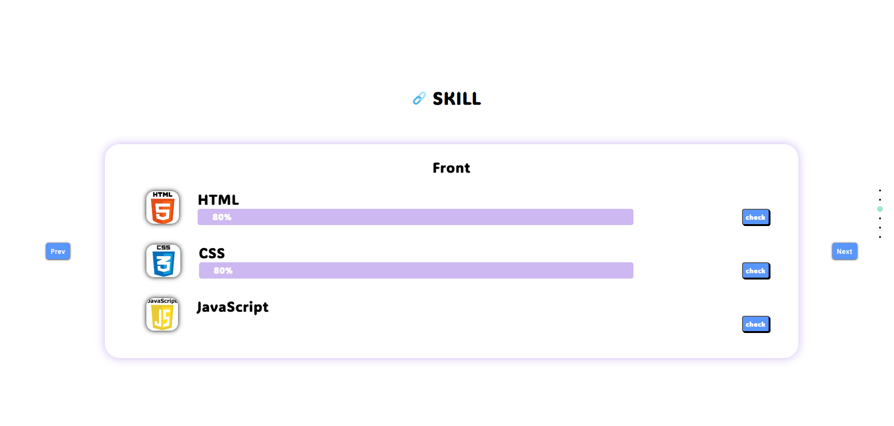
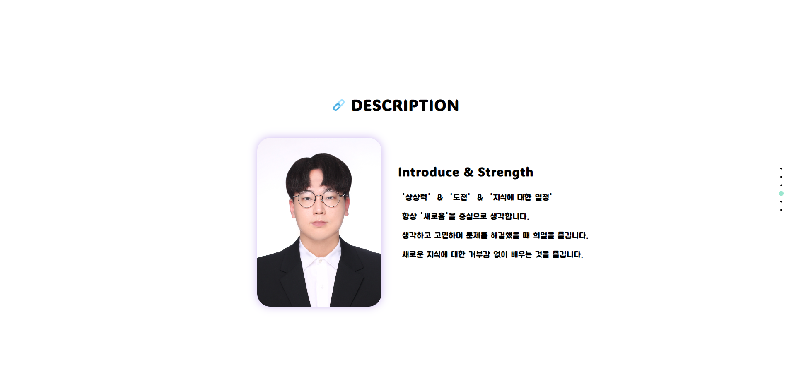
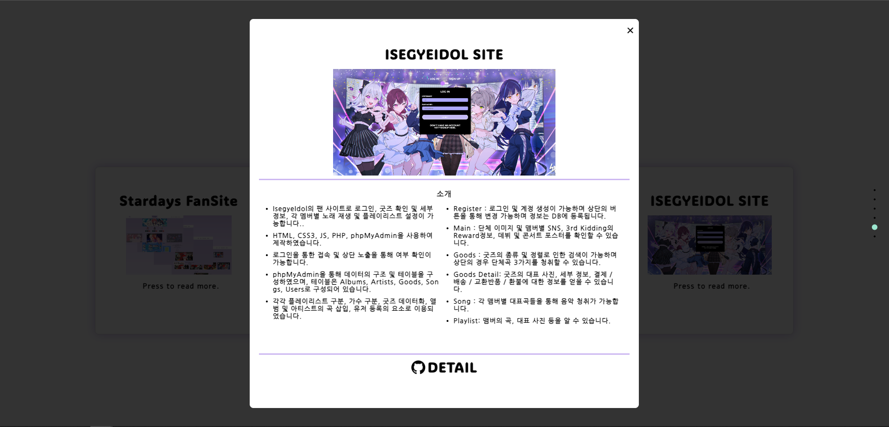
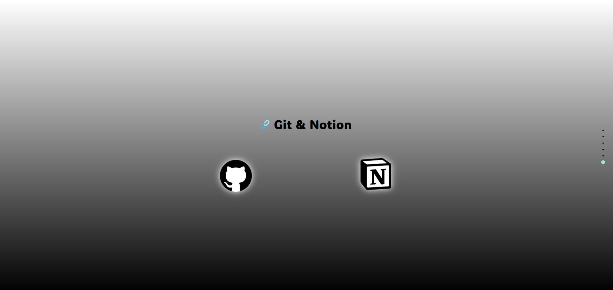

# **Portfolio Site**

<!--목차-->
## **목차**
- [**Project**](#project)
    - [Page Information](#page-information)
    - [Features](#features)
    - [Techniques](#techniques)
- [**Page**](#page)
    - [Start Page](#start-page)
    - [Introduce Page](#introduce-page)
    - [Skill Page](#skill-page)
    - [Description Page](#description-page)
    - [Portfolio Page](#portfolio-page)
    - [SNS Page](#sns-page)
- [**Contact**](#contact)

<!--프로젝트 설명-->
## **Project**
- 해당 프로젝트는 저를 소개하기 위한 **Portfolio Site**입니다.
- 저에 대한 설명과 정보를 나타내기 위해 작성되었습니다.

### **Page Information**
- Start Page        : 스크롤을 통해 화면 전환이 가능함을 명시합니다.
- Introduce Page    : 개인정보를 간략히 볼 수 있습니다.
- Skill Page        : 현재 가능한 언어 및 툴, 자격증의 숙련도를 확인할 수 있습니다.
- Description Page  : 스스로를 나타낼 수 있는 단어와 이에 대한 설명입니다.
- Portfolio Page    : 공부한 내용을 나타내기 위한 포트폴리오와 이에 대한 설명입니다. Modal을 이용하여 작업하였습니다.
- SNS Page          : 사용하는 사이트 입니다.

### **Features**
- 자신을 소개하는 사이트 입니다.
- 기본적인 사용을 위해 HTML5, CSS3, JavaScript만 이용하였습니다.

### **Techniques**
- [HTML5], [CSS3], [JavaScript]
- [Visual Studio Code]

<!--각 페이지 설명-->
## **Page**

### **Start Page**

- **Start Page**입니다. 해당 페이지는 초기 로드 화면입니다.
- GSAP를 이용하여 글자가 무작위 위치에서 날아오는 애니메이션을 이용하였습니다.
- FullPage 라이브러리를 이용하여 Section이 한 화면을 사용하도록 이용하였습니다.
- 로드 후 2초 후에 다음페이지 이동 글자가 나타납니다.

 

### **Introduce Page**

- **Introduce Page**입니다. 저에 대한 정보를 간략하게 나타내었습니다.

 

### **Skill Page**

- **Skill Page**입니다. 현재 사용 가능한 언어와 보유 자격증, 다루는 Tool을 명시하였습니다.
- check 버튼을 통해 Progress Bar와 Percent를 확인할 수 있습니다.

 

### **Description Page**

- **Description Page**입니다. 소개 및 장점에 대해 작성하였습니다.
- 저를 나타낼 수 있는 단어 3개를 이용하여 소개하였습니다.

 

### **Portfolio Page**

- **Portfolio Page**입니다. 공부한 내용을 바탕으로 작업한 프로젝트를 나타내었습니다.
- 각 카트형식으로 존재하며 Modal을 이용해 상세 정보를 확인 할 수 있습니다.
- Detail 버튼의 경우 해당 프로젝트의 GitHub 사이트로 이동됩니다.

 

### **SNS Page**

- **SNS Page**입니다. 이용하고 있는 GitHub과 Notion에 대해 작성하였습니다.
- 이 또한 Modal로 작성되며 상세정보의 Icon을 클릭하는 경우 대표 사이트로 이동됩니다.

<!--접근-->
## **Contact**
- 📧  **wodnd565@gmail.com**
- 📞  **010 - 5657 - 4813**
